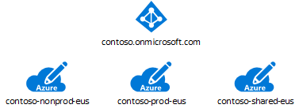
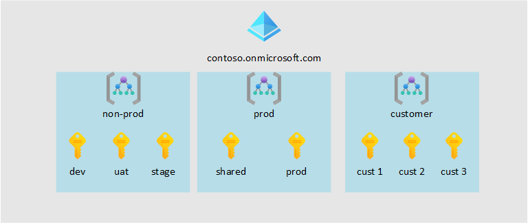
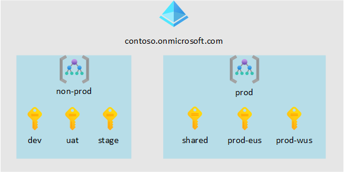
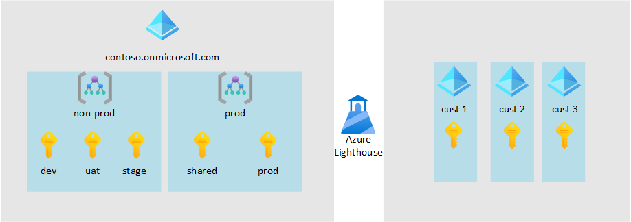

# Subscription design for ISVs

Prepare your Azure solution by creating an initial set of subscriptions. 

## Initial subscriptions

Start by creating three subscriptions:

- Create an initial subscription to contain your nonproduction resources, consider using an [Azure Dev/Test offer](https://azure.microsoft.com/pricing/dev-test) for lower pricing.
- Create a second subscription to contain your production resources.
- Create a third subsctiption to contain resources shared between your environments. For Example: management nodes, networking components, and identity services. 
- Align subscriptions to the region you intend to deploy your solution.

_Figure 1: An initial subscription model with keys next to boxes labeled "prod", "nonprod" and "shared"._

Benefits with this approach:

- Using separate subscriptions for your environments creates a security boundary that makes management of access to your resources simpler and safer.
- Your environments will likely have different sets of Azure policies. Using separate subscriptions makes it simple to apply each distinct policy at the subscription level.
- Service Limits are managed at a [subscription level](https://docs.microsoft.com/en-us/azure/cloud-adoption-framework/ready/azure-best-practices/scale-subscriptions#technical-considerations) and some are managed at a [regional level](https://docs.microsoft.com/en-us/azure/azure-resource-manager/management/azure-subscription-service-limits#managing-limits), using seperate subcriptions for your environements allows you to scale your solution without the danger of running into service limits.
- A shared environment allows you to place resources and services that your other workloads will consume into a distinct environment that has seperate resource lifecycles from your application. This enables cost savings by allowing you to consolidate resources so they don't need to be deployed into each environment.
- The acceptable cost thresholds that will likely vary between environments, this will give you the simplest view into the cost of running each environment and allow greater cost control per environment.
- In Automated deployments you can create a Service Principal scoped to each of your environments to mitigate risk and limit the blast radius in case the credentials of your Service Principals are exposed.

## Scaling subscriptions

As your solution matures you may need to create additional subscriptions for your customers, additional dev teams, or for deploying out your solution across multiple regions. 

The way in which you scale your subscriptions will be inflienced by:

- Your application design [multi-tenant](https://docs.microsoft.com/en-us/azure/dotnet-develop-multitenant-applications) or single-tenant.
- Whether you plan on managing the solution after deployment. 
- Where your solution will be deployed, either in an Azure environment that you own or the customer owns. 

### Scale with Management Groups

As the number of subscriptions increases the management overhead will increase. To alleviate this, utilize [management groups](https://docs.microsoft.com/en-us/azure/governance/management-groups/overview) to organize sbusciptions together in a logical container.

### Example: Single-tenant solution ISV hosted and managed

_Figure 2: A scaled design using management groups for a single-tenant ISV hosted and managed solution._

Design Considerations:

- Having customer deployments contained in a dedicated subscription allows for the easiest chargeback model.
- Allows you to scale to N number of customers without risk of running into service limits.
- Allows consistent policy management for all customer deployments.

### Example: Multi-tenant solution ISV hosted and managed

_Figure 2: A scaled design using management groups for a multi-tenant ISV hosted and managed solution._

Design Considerations:

- Consider having seperate subscriptions per region that you will deploy your solution into, this lets your solution scale as your footprint grows without hitting service limits.
- Using Management Groups to contain all of the production subscriptions will ensure consistent Policy application.

### Scale with Azure Lighthouse

If you are planning on deploying your solution into your Customers Azure environment but still need to be able to manage the solution after deployment Azure Lighthouse can enable cross- and multi-tenant management, allowing for higher automation, scalability, and enhanced governance across resources and tenants. 

### Example: Single-tenant solution Customer hosted and ISV managed

_Figure 2: A scaled design using Azure Lighthouse for a single-tenant Customer hosted and ISV managed solution._

Design Considerations:

- Azure Lighthouse allows for the easiest management experience without having to create identities in your Customer's Azure tenant.